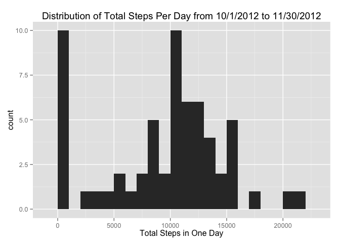
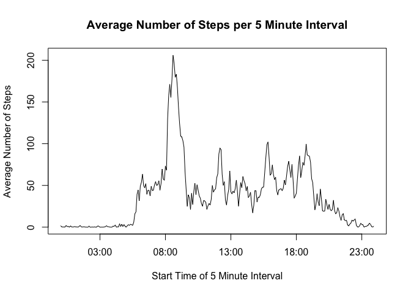
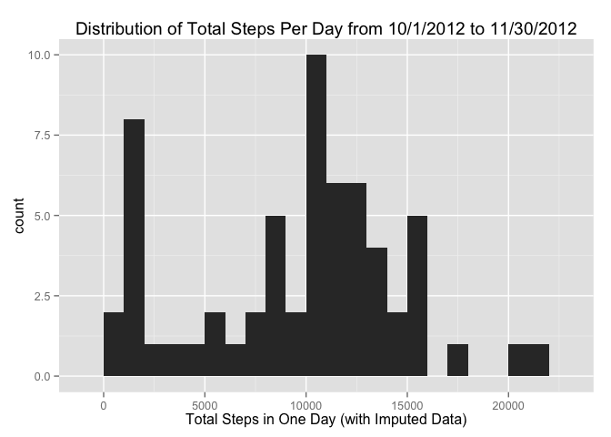

# Reproducible Research: Peer Assessment 1


## Loading and preprocessing the data


```r
# Assuming csv file is in the current workspace directory
data <- read.csv("activity.csv",colClasses=c("numeric","character","numeric"))
data$date<-as.Date(data$date)
# Creating a time variable to represent the interval. The date on this variable will not be used.
int<-data$interval
data$time<-strptime(paste(floor(int/100),":",int-100*floor(int/100),sep=""),format="%H:%M")
summary(data)
```

```
##      steps             date               interval     
##  Min.   :  0.00   Min.   :2012-10-01   Min.   :   0.0  
##  1st Qu.:  0.00   1st Qu.:2012-10-16   1st Qu.: 588.8  
##  Median :  0.00   Median :2012-10-31   Median :1177.5  
##  Mean   : 37.38   Mean   :2012-10-31   Mean   :1177.5  
##  3rd Qu.: 12.00   3rd Qu.:2012-11-15   3rd Qu.:1766.2  
##  Max.   :806.00   Max.   :2012-11-30   Max.   :2355.0  
##  NA's   :2304                                          
##       time                    
##  Min.   :2015-10-17 00:00:00  
##  1st Qu.:2015-10-17 05:58:45  
##  Median :2015-10-17 11:57:30  
##  Mean   :2015-10-17 11:57:30  
##  3rd Qu.:2015-10-17 17:56:15  
##  Max.   :2015-10-17 23:55:00  
## 
```

## What is mean total number of steps taken per day?

```r
library(plyr)
library(ggplot2)
stepsPerDay <- ddply(data,.(date),summarize,totalSteps=sum(steps,na.rm=TRUE))
qplot(totalSteps,data=stepsPerDay,binwidth=1000,xlab="Total Steps in One Day",main="Distribution of Total Steps Per Day from 10/1/2012 to 11/30/2012")
```

 


####*The mean total steps per day is 9,354 and the median total steps per day is 10,395.*


## What is the average daily activity pattern?

```r
stepsPerInterval <- ddply(data,.(time),summarize,avgSteps=mean(steps,na.rm=TRUE))
with(stepsPerInterval,plot(time,avgSteps,type="l",xlab="Start Time of 5 Minute Interval", ylab="Average Number of Steps",main="Average Number of Steps per 5 Minute Interval"))
```

 

```r
maxInterval <-stepsPerInterval$time[stepsPerInterval$avgSteps==max(stepsPerInterval$avgSteps)]
```


####*The 5 minute interval from 08:35 to 08:40 contains the maximum average number of steps.*

## Imputing missing values

####*Of the 17,568 intervals in this data set, 2,304 have missing values.*


```r
# For missing number of steps, I'm imputting the median of that time interval from the other days
medianStepsPerInterval <- ddply(data,.(interval),summarize,medSteps=median(steps,na.rm=TRUE))
inputedData<-data
inputedData$steps[is.na(data$steps)]<-sapply(data$interval[is.na(data$steps)], function(x) {medianStepsPerInterval$medSteps[medianStepsPerInterval$interval==x]})
stepsPerDayInputed <- ddply(inputedData,.(date),summarize,totalSteps=sum(steps,na.rm=TRUE))
qplot(totalSteps,data=stepsPerDayInputed,binwidth=1000,xlab="Total Steps in One Day (with Imputed Data)",main="Distribution of Total Steps Per Day from 10/1/2012 to 11/30/2012")
```

 


####*After data is inputed, the mean total steps per day is 9,504 and the median total steps per day is 10,395. This mean is higher than it was before values were inputed because when missing values are ignored, many steps are missed. For example, 8 days had all missing values, so these days had totals of 0 steps. These zero totals pulled the mean down. The median, however, did not change because the total inputed for days with missing values was still small (1141 steps) relative to the typical totals. Thus, the middle ranked value of these totals did not move.*

## Are there differences in activity patterns between weekdays and weekends?


```r
daytype<-factor(rep(NA,length(data$date)),levels=c("weekend","weekday"))
daytype[weekdays(data$date) %in% c("Sunday","Saturday")]<-"weekend"
daytype[!weekdays(data$date) %in% c("Sunday","Saturday")]<-"weekday"
inputedData$daytype<-daytype
byDaytype <- ddply(inputedData,.(time,daytype),summarize,avgSteps=mean(steps))
library(lattice)
byDaytype$minsPastMidnight<-as.numeric(format(byDaytype$time, "%H"))*60 + as.numeric(format(byDaytype$time, "%M"))
xyplot(avgSteps ~ minsPastMidnight | daytype, data = byDaytype, layout = c(1, 2),type="l",xlab="Time Interval in # Minutes Past Midnight",ylab="Number of Steps",main="Average Number of Steps by Time Interval")
```

 

```r
meanWeekend<-round(mean(byDaytype$avgSteps[byDaytype$daytype=="weekend"]),0)
meanWeekday<-round(mean(byDaytype$avgSteps[byDaytype$daytype=="weekday"]),0)
```

####*Activity starts earlier on weekdays, but goes later on weekends. The overall activity appears slightly higher on weekends: the overall mean is 38 steps in 5 minutes on weekends versus 31 steps on Weekdays.*
